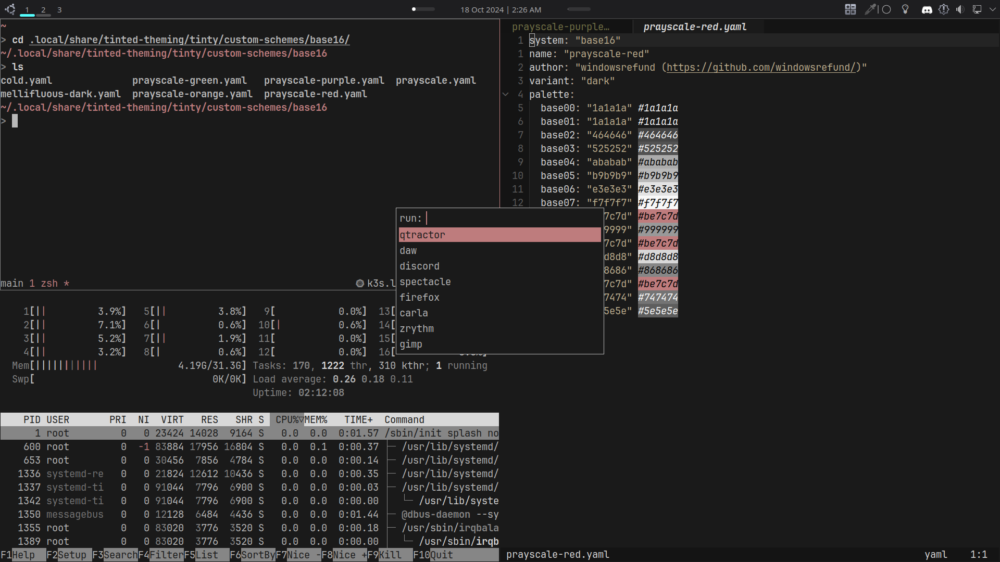
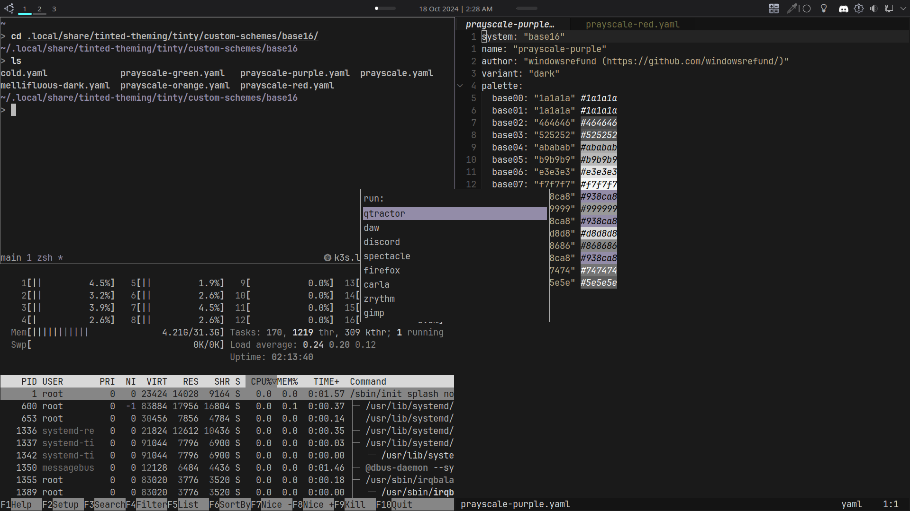
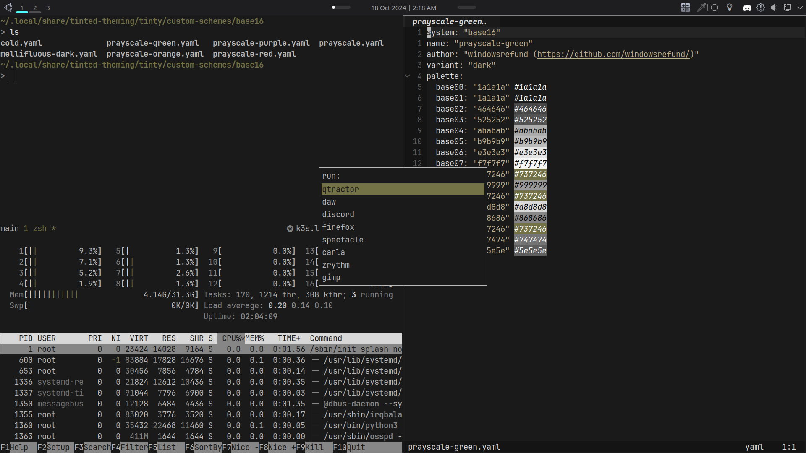
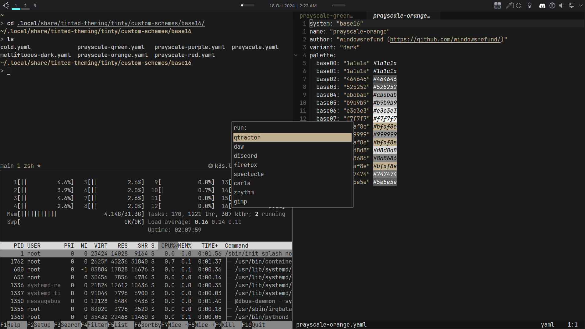

# base16-prayscale

Created as [custom schemes](https://github.com/tinted-theming/tinty/blob/main/USAGE.md#use-your-own-schemes) for use with [tinted-theming/tinty](https://github.com/tinted-theming/tinty). These are based on [grayscale-dark](https://github.com/tinted-theming/schemes/blob/spec-0.11/base16/grayscale-dark.yaml) but highlighted using colors from [mellifluous.nvim](https://github.com/ramojus/mellifluous.nvim).

## prayscale-red

## prayscale-purple

## prayscale-green

## prayscale-orange

